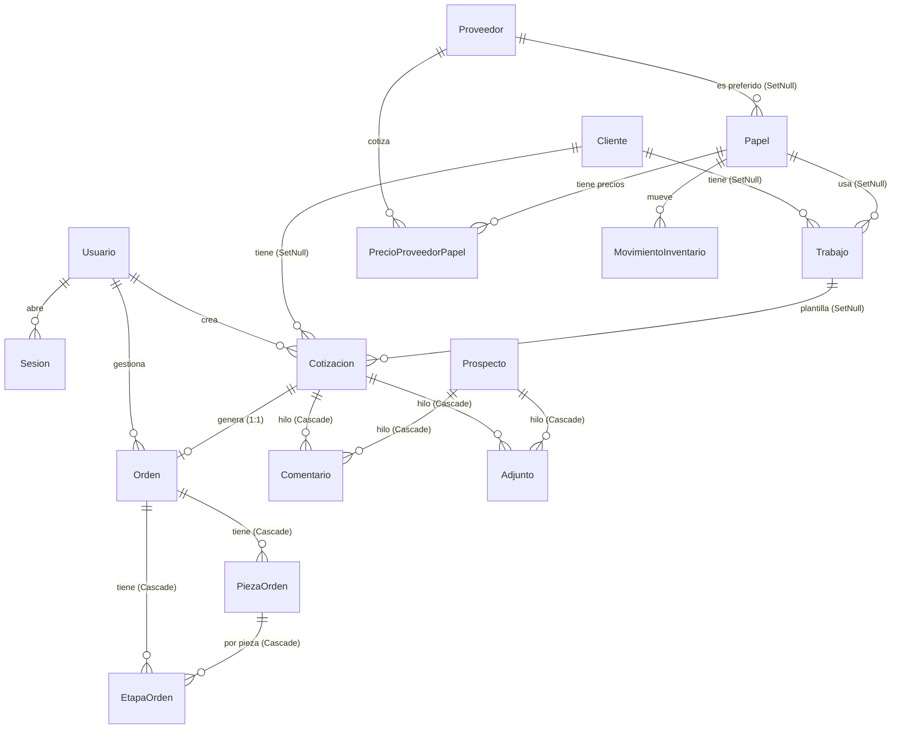

# Modelo de datos — tablas y relaciones

> **Fuente de verdad:** `prisma/schema.prisma`. Este documento se genera a mano a
> partir de ese esquema; si difieren, manda el esquema. PostgreSQL en Railway.
> **24 modelos · 11 enums.** Todas las fechas son `Timestamptz(3)` (con zona).
> El dinero se guarda en `Decimal` con la precisión que indica cada campo.

## Índice
1. [Vista de conjunto (diagrama ER)](#vista-de-conjunto)
2. [Cómo se relacionan (FK duras vs enlaces suaves)](#relaciones)
3. [Enums](#enums)
4. [Tablas, campo por campo](#tablas)
5. [Máquinas de estado](#maquinas-de-estado)

---

## Vista de conjunto

Cinco áreas: **acceso** (usuarios/sesiones), **catálogo** (papeles, acabados,
materiales, equipos, proveedores, config), **comercial** (clientes, prospectos,
actividades, cotizaciones), **producción** (órdenes, etapas, piezas, inventario)
y **transversal** (hilo del trabajo, auditoría, tasas).



> Los modelos **Config** (fila única `global`), **Tasa**, **RegistroAuditoria**,
> **Actividad**, **MaterialGF**, **ProductoGF**, **ProductoPop** y **Equipo** no
> tienen llaves foráneas duras (ver la sección siguiente); por eso no aparecen
> conectados en el diagrama.

---

## Relaciones

Hay **dos formas** de enlace en el sistema, a propósito:

### Llaves foráneas DURAS (con `@relation` y `onDelete`)
El borrado se propaga o se anula según la regla:

| Desde | Hacia | Campo | Al borrar el padre |
|---|---|---|---|
| Sesion | Usuario | `usuarioId` | **Cascade** (se cierra la sesión) |
| Papel | Proveedor | `proveedorPreferidoId` | **SetNull** (queda sin preferido) |
| PrecioProveedorPapel | Papel | `papelId` | **Cascade** |
| PrecioProveedorPapel | Proveedor | `proveedorId` | **Cascade** |
| MovimientoInventario | Papel | `papelId` | **Cascade** |
| Trabajo | Cliente | `clienteId` | **SetNull** |
| Trabajo | Papel | `papelId` | **SetNull** |
| Cotizacion | Cliente | `clienteId` | **SetNull** |
| Cotizacion | Trabajo | `trabajoId` | **SetNull** |
| Cotizacion | Usuario | `usuarioId` | **SetNull** |
| Comentario | Cotizacion **o** Prospecto | `cotizacionId` / `prospectoId` | **Cascade** |
| Adjunto | Cotizacion **o** Prospecto | `cotizacionId` / `prospectoId` | **Cascade** |
| Orden | Cotizacion | `cotizacionId` (**@unique**, 1:1) | **Cascade** |
| Orden | Usuario | `usuarioId` | **SetNull** |
| EtapaOrden | Orden | `ordenId` | **Cascade** |
| EtapaOrden | PiezaOrden | `piezaId` | **Cascade** |
| PiezaOrden | Orden | `ordenId` | **Cascade** |

**XOR del hilo:** cada `Comentario` y cada `Adjunto` cuelga de **exactamente uno**
de `cotizacionId` **o** `prospectoId` (nunca ambos, nunca ninguno). La regla se
valida en la aplicación (`crearComentario` / `crearAdjunto`) y hay un `CHECK` en
la migración correspondiente.

### Enlaces SUAVES (por id, SIN llave foránea)
Se guarda el id pero no hay FK: no hay cascada ni integridad referencial forzada.
Es deliberado (el registro debe sobrevivir aunque el objeto enlazado desaparezca):

| Modelo | Campos de enlace suave | Por qué sin FK |
|---|---|---|
| Prospecto | `clienteId`, `cotizacionId`, `usuarioId` | la oportunidad sobrevive aunque cambie el resto |
| Actividad | `clienteId`, `prospectoId`, `cotizacionId`, `usuarioId` | recordatorio comercial ligero |
| MovimientoInventario | `ordenId`, `usuarioId` | trazabilidad, no integridad |
| RegistroAuditoria | `actorId`, `entidad` | la bitácora sobrevive al borrado del actor |
| Cotizacion | `clienteNombre` (texto) | respaldo de lo escrito antes del CRUD de clientes |

Además, varios modelos congelan el **nombre** junto al id (`autorNombre`,
`actorNombre`, `clienteNombre`, `proveedorNombre`): así el registro sigue siendo
legible aunque se borre el usuario/cliente/proveedor original.

---

## Enums

| Enum | Valores | Usado en |
|---|---|---|
| **Rol** | `SUPERADMIN`, `ADMIN`, `VENDEDOR`, `TALLER` | Usuario.rol |
| **TipoMovimiento** | `ENTRADA`, `SALIDA`, `AJUSTE` | MovimientoInventario.tipo |
| **EstadoCotizacion** | `BORRADOR`, `PENDIENTE`, `APROBADA`, `ENVIADA`, `GANADA`, `RECHAZADA`, `VENCIDA` | Cotizacion.estado |
| **TipoCotizacion** | `PROPIA`, `PROVEEDOR`, `GRAN_FORMATO`, `PERSONALIZADO`, `OFFSET`, `MIXTA` | Cotizacion.tipo |
| **EstadoOrden** | `PENDIENTE`, `EN_PROCESO`, `TERMINADA`, `ENTREGADA`, `ANULADA` | Orden.estado |
| **EstadoEtapa** | `PENDIENTE`, `EN_PROCESO`, `LISTA`, `OMITIDA` | EtapaOrden.estado |
| **CarrilPieza** | `INTERNO`, `TERCERIZADO` | PiezaOrden.carril |
| **EstadoPieza** | interno: `EN_COLA`, `EN_DISENO`, `ESPERANDO_ARTE`, `EN_IMPRESION`, `EN_ACABADO`, `LISTA` · tercerizado: `POR_COTIZAR`, `COMPRADO`, `RECIBIDO`, `ENTREGADO` | PiezaOrden.estado |
| **EstadoCobro** | `NO_FACTURADO`, `FACTURADO`, `COBRADO` | Orden.estadoCobro |
| **ProspectoEstado** | `NUEVO`, `CONTACTADO`, `CONVERTIDO`, `DESCARTADO` | Prospecto.estado |
| **ActividadTipo** | `REUNION`, `LLAMADA`, `SEGUIMIENTO`, `NOTA` | Actividad.tipo |

---

## Tablas

Notación: 🔑 llave primaria · 🔗 FK dura · ~ enlace suave (id sin FK) · ⭐ único · ▹ índice.

### Acceso

**Usuario** — cuentas y permisos.
| Campo | Tipo | Nota |
|---|---|---|
| 🔑 id | String (cuid) | |
| ⭐ email | String | único |
| nombre, passwordHash | String | bcrypt |
| rol | Rol | default `VENDEDOR` |
| activo | Boolean | default true |
| interpretarIA | Boolean? | null = hereda del sistema |
| puedeCotizar | Boolean | interruptor general de cotizar |
| tiposCotizar | String[] | tipos permitidos; vacío = todos |
| puedeEliminar | Boolean | borrar cotizaciones en borrador |
| verEstructura | Boolean | ver costo/margen, no solo precio |
| creadoEn | DateTime | |
| _relaciones_ | | `cotizaciones[]`, `ordenes[]`, `sesiones[]` |

**Sesion** — sesiones activas (la BD manda sobre el token).
| Campo | Tipo | Nota |
|---|---|---|
| 🔑 id | String | |
| 🔗 usuarioId | String | → Usuario (Cascade) ▹ |
| ⭐ token | String | único |
| expiraEn | DateTime | ventana deslizante |

### Comercial: clientes, prospectos, actividades

**Cliente** — directorio de clientes.
| Campo | Tipo | Nota |
|---|---|---|
| 🔑 id | String | |
| nombre | String | ▹ |
| rif, contacto, telefono, email, direccion, notas | String? | |
| activo | Boolean | default true |
| creadoEn | DateTime | |
| _relaciones_ | | `trabajos[]`, `cotizaciones[]` |

**Prospecto** — oportunidad comercial antes de cotizar (CRM; reemplaza el tablero de Trello).
| Campo | Tipo | Nota |
|---|---|---|
| 🔑 id | String | |
| nombre | String | qué quiere / nombre de la oportunidad |
| ~ clienteNombre, clienteId | String? | enlace suave a Cliente |
| contacto, detalle | String? | |
| estado | ProspectoEstado | default `NUEVO` ▹ |
| ~ cotizacionId | String? | cotización creada al convertir |
| ~ usuarioId | String? | quién lo capturó |
| creadoEn, actualizadoEn | DateTime | |
| _relaciones duras_ | | `comentarios[]`, `adjuntos[]` (Cascade) |

**Actividad** — recordatorio comercial (reunión, llamada, seguimiento, nota).
| Campo | Tipo | Nota |
|---|---|---|
| 🔑 id | String | |
| tipo | ActividadTipo | default `REUNION` |
| titulo | String | |
| fecha | DateTime? | cuándo está agendada |
| hecha | Boolean | ▹ índice `(hecha, fecha)` |
| notas | String? | |
| ~ clienteId, clienteNombre, prospectoId, cotizacionId, usuarioId | | enlaces suaves |
| creadoEn | DateTime | |

### Catálogo: papeles, proveedores, acabados, materiales, equipos

**Papel** — catálogo de papeles + inventario + costeo.
| Campo | Tipo | Nota |
|---|---|---|
| 🔑 id | String | |
| ⭐ clave | String | estable para el motor (ej. `Litho Autoadhesivo-200`) |
| nombre | String | |
| hojas | Int | hojas por resma/paquete |
| precio | Decimal(12,4) | precio EFECTIVO USD de la resma (copia del preferido) |
| medida | String | `66x96` / `68x96` / `70x100` |
| categoria | String | default `Papel` |
| activo | Boolean | |
| stock, stockMin | Decimal(14,2) | inventario en pliegos completos |
| ~🔗 proveedorPreferidoId | String? | → Proveedor (SetNull) |
| _relaciones_ | | `trabajos[]`, `movimientos[]`, `preciosProveedor[]` |

**Proveedor** — proveedores de papel/material (Fase 3).
| Campo | Tipo | Nota |
|---|---|---|
| 🔑 id | String | |
| ⭐ nombre | String | único |
| moneda | String | default `USD` |
| contacto, notas | String? | |
| predeterminado | Boolean | respaldo global de costeo |
| activo | Boolean | |
| creadoEn | DateTime | |
| _relaciones_ | | `precios[]`, `papelesPreferido[]` |

**PrecioProveedorPapel** — precio de un papel según un proveedor (una fila por par).
| Campo | Tipo | Nota |
|---|---|---|
| 🔑 id | String | |
| 🔗 papelId | String | → Papel (Cascade) |
| 🔗 proveedorId | String | → Proveedor (Cascade) ▹ |
| precio | Decimal(12,4) | en la unidad indicada |
| unidad | String | `resma` / `hoja` / `millar` |
| hojas | Int? | hojas/resma según este proveedor |
| medida | String? | |
| vigenteDesde | DateTime | |
| notas | String? | |
| ⭐ | | único `(papelId, proveedorId)` |

**MovimientoInventario** — kardex de papel en pliegos (cantidad con signo).
| Campo | Tipo | Nota |
|---|---|---|
| 🔑 id | String | |
| 🔗 papelId | String | → Papel (Cascade) ▹ |
| tipo | TipoMovimiento | ENTRADA/SALIDA/AJUSTE |
| cantidad | Decimal(14,2) | + entra, − sale |
| saldo | Decimal(14,2) | stock resultante (auditoría) |
| motivo | String? | |
| ~ ordenId, usuarioId | String? | enlaces suaves |
| fecha | DateTime | ▹ |

**Acabado** — catálogo de acabados que usa el motor (impresión, troquel…).
| Campo | Tipo | Nota |
|---|---|---|
| 🔑 id · ⭐ clave | String | `impTiro`, `troquel`… la usa el motor |
| label | String | |
| costo | Decimal(12,4) | tarifa base referida a 1/4 de pliego |
| unidad | String | `pliego` / `elemento` / `millar` / `trabajo` |
| escala | String | `area` / `min` / `fija` (solo unidad `pliego`) |
| orden | Int | |
| modulo | String | `digital` u `offset` |
| grupo | String? | acabados del mismo grupo son excluyentes |
| activo | Boolean | |

**MaterialGF** — material de gran formato tercerizado (costo por m²).
| Campo | Tipo | Nota |
|---|---|---|
| 🔑 id · ⭐ clave | String | |
| nombre, categoria | String | default categoria `Banner` |
| costoM2 | Decimal(12,4) | costo USD/m² (a BCV) |
| modoCobro | String | `mancha` / `ancho_rollo` / `etiqueta` |
| anchosRollo | String | anchos disponibles en cm, `105,137,152` |
| montaje, tablaEtq | String | lámina y rendimiento (modo etiqueta) |
| activo | Boolean | |

**ProductoGF** — productos terminados de gran formato (pendones, roll up…). Costo fijo por unidad.
| Campo | Tipo | Nota |
|---|---|---|
| 🔑 id · ⭐ clave | String | |
| nombre, categoria, medida | String | categoria `Pendón`/`Roll Up`/`Araña`/`Estructura` |
| costoUnit | Decimal(12,4) | costo USD/unidad (a BCV) |
| activo | Boolean | |

**ProductoPop** — personalizados / material POP tercerizado (chapas, llaveros, DTF…).
| Campo | Tipo | Nota |
|---|---|---|
| 🔑 id · ⭐ clave | String | |
| nombre, categoria | String | |
| modo | String | `escalas` / `lineal` |
| escalas | String | `1:3.5,12:2.2,50:2.1,100:1.5` (desde:precio) |
| precioLineal | Decimal(12,4) | costo USD/metro lineal (modo lineal) |
| anchoCm, minCm | Int | ancho fijo y largo mínimo (modo lineal) |
| unidad | String | etiqueta `unidad`/`docena` |
| activo | Boolean | |

**Equipo** — prensas y equipos del taller (offset: colores por pasada).
| Campo | Tipo | Nota |
|---|---|---|
| 🔑 id · ⭐ clave | String | |
| nombre | String | |
| coloresPasada | Int | default 4 (4/0 en una pasada; 1 color → 4 pasadas) |
| costoMillar | Decimal(12,4) | default 6, por millar de pliegos/pasada |
| costoArranque | Decimal(12,4) | default 15, arranque por cara |
| activo | Boolean | |

**Config** — variables del negocio (fila única `id = "global"`).
| Campo | Tipo | Default | Nota |
|---|---|---|---|
| 🔑 id | String | `"global"` | fila única |
| merma, margen, comision, ml | Decimal(6,2) | 3 / 30 / 3 / 12 | % del negocio |
| tasaBCV, binCompra, binVenta | Decimal(14,4) | — | tasas vigentes |
| pinza, sep | Decimal(6,2) | 5 / 3 | montaje (mm) |
| margenMin | Decimal(6,2) | 15 | avisa si el margen baja |
| iva | Decimal(6,2) | 16 | % IVA al cliente |
| interpretarIA, interpretarModelo | Boolean/String? | false / null | intérprete IA global |
| gfOjeteCosto, gfOjeteCm | Decimal/Int | 0.8 / 40 | gran formato: ojetes |
| offPlancha, offPlanchaMedio, offPlanchaPliego | Decimal(12,4) | 4 / 7 / 12 | planchas offset |
| offArranque, offMillar, offTinta | Decimal(12,4) | 12 / 5 / 2 | offset: arranque/millar/tinta |
| empresaNombre…empresaWeb | String? | — | membrete de la cotización |
| actualizadoEn | DateTime | @updatedAt | |

**Tasa** — histórico de tasas (con qué cambio se cotizó cada trabajo).
| Campo | Tipo | Nota |
|---|---|---|
| 🔑 id | String | |
| fecha | DateTime | ▹ |
| bcv, binCompra, binVenta | Decimal(14,4) | |

### Trabajos y cotizaciones

**Trabajo** — plantilla de un trabajo repetido (guarda la receta, no el precio).
| Campo | Tipo | Nota |
|---|---|---|
| 🔑 id | String | |
| ~🔗 clienteId | String? | → Cliente (SetNull) ▹ |
| nombre, descripcion | String | |
| ancho, alto | Int | mm |
| tamano | String | `1/4 Pliego`… |
| ~🔗 papelId | String? | → Papel (SetNull) |
| capacidad | Int | piezas por corte |
| capAuto | Boolean | |
| acabados | Json | `{ "impTiro": { "on": true, "q": 1 }, … }` |
| archivado | Boolean | |
| creadoEn | DateTime | |
| _relaciones_ | | `cotizaciones[]` |

**Cotizacion** — cotización **inmutable**: congela papeles/acabados/tasas usados.
| Campo | Tipo | Nota |
|---|---|---|
| 🔑 id | String | |
| ⭐ numero | Int | autoincrement |
| estado | EstadoCotizacion | default `BORRADOR` ▹ |
| tipo | TipoCotizacion | default `PROPIA` |
| ~🔗 clienteId | String? | → Cliente (SetNull) ▹ |
| proveedorNombre, proveedorRef, proveedorNotas | String? | tercerizado |
| ~ clienteNombre | String? | texto libre (respaldo) |
| ~🔗 trabajoId, usuarioId | String? | → Trabajo/Usuario (SetNull) |
| titulo, descripcion | String | |
| cantidad, ancho, alto, capacidad | Int | |
| tamano, papelNombre | String | |
| entrada, snapshot, lineas | Json | congelado del cálculo |
| items | Json? | array de ítems (null en las viejas) |
| pliegos | Decimal(14,4) | |
| costoTotal | Decimal(14,4) | |
| costoUnit | Decimal(14,6) | |
| diferencial | Decimal(10,6) | |
| margen | Decimal(6,2) | |
| precioUnit | Decimal(14,6) | |
| ventaTotal | Decimal(14,4) | |
| precioML | Decimal(14,6) | |
| tasaBCV | Decimal(14,4) | |
| precioBs | Decimal(16,4) | |
| validaHasta | DateTime? | |
| notas, refCotizacion | String? | ref al sistema externo |
| creadaEn | DateTime | ▹ |
| _relaciones_ | | `orden?` (1:1), `comentarios[]`, `adjuntos[]` |

### Hilo del trabajo (sin precios — seguro para TALLER)

**Comentario** — comentario del hilo, anclado a Cotizacion **XOR** Prospecto.
| Campo | Tipo | Nota |
|---|---|---|
| 🔑 id | uuid (`gen_random_uuid()`) | |
| ~🔗 cotizacionId | String? | → Cotizacion (Cascade) ▹ |
| ~🔗 prospectoId | String? | → Prospecto (Cascade) ▹ |
| autorId | String? | null si se borra el usuario |
| autorNombre | String | congelado |
| texto | String | |
| creadoEn | DateTime | |

**Adjunto** — arte/referencia/prueba del hilo, anclado a Cotizacion **XOR** Prospecto.
| Campo | Tipo | Nota |
|---|---|---|
| 🔑 id | uuid | |
| ~🔗 cotizacionId, prospectoId | String? | → Cascade, XOR ▹▹ |
| autorId, autorNombre | | |
| nombre, tipo | String | tipo = mime |
| tamano | Int | bytes |
| almacen | String | `db` (bytes en `datos`) / `drive` |
| datos | Bytes? | bytea cuando almacen=`db` |
| driveFileId, url | String? | cuando almacen=`drive` |
| creadoEn | DateTime | |

### Producción

**Orden** — orden de producción generada 1:1 desde una cotización. **Sin precios.**
| Campo | Tipo | Nota |
|---|---|---|
| 🔑 id | String | |
| ⭐ numero | Int | autoincrement |
| ⭐🔗 cotizacionId | String | → Cotizacion (Cascade), 1:1 |
| estado | EstadoOrden | default `PENDIENTE` ▹ |
| ~🔗 usuarioId | String? | → Usuario (SetNull) |
| fechaEntrega | DateTime? | ▹ |
| prioridad | Int | |
| instrucciones | String? | |
| items | Json? | proyección SIN precios para el taller |
| inventarioAplicado | Boolean | si ya descontó papel al terminar |
| estadoCobro | EstadoCobro | default `NO_FACTURADO` |
| fechaFactura, fechaCobro, cerradaEn | DateTime? | |
| creadaEn | DateTime | |
| _relaciones_ | | `etapas[]`, `piezas[]` |

**EtapaOrden** — cada acabado se vuelve una etapa del taller.
| Campo | Tipo | Nota |
|---|---|---|
| 🔑 id | String | |
| 🔗 ordenId | String | → Orden (Cascade) ▹ |
| clave, nombre | String | misma clave del acabado |
| orden | Int | |
| estado | EstadoEtapa | default `PENDIENTE` |
| responsable | String? | |
| iniciadaEn, terminadaEn | DateTime? | |
| notas | String? | |
| ~🔗 piezaId | String? | → PiezaOrden (Cascade) ▹ |

**PiezaOrden** — una pieza (ítem) de la orden, con su carril y estado (Fase 2).
| Campo | Tipo | Nota |
|---|---|---|
| 🔑 id | String | |
| 🔗 ordenId | String | → Orden (Cascade) ▹ |
| carril | CarrilPieza | INTERNO / TERCERIZADO |
| tipo | String | TipoCotizacion del ítem |
| titulo | String | |
| cantidad | Int | |
| estado | EstadoPieza | ▹ |
| orden | Int | |
| proveedorNombre | String? | |
| snapshot | Json? | ItemProd sin precios |
| notas | String? | |
| creadaEn, actualizadaEn | DateTime | |
| _relaciones_ | | `etapas[]` |

### Transversal

**RegistroAuditoria** — bitácora solo-agregar; solo SUPERADMIN purga (por rango, dejando rastro).
| Campo | Tipo | Nota |
|---|---|---|
| 🔑 id | String | |
| fecha | DateTime | ▹ |
| actorId, actorNombre | String? | congela el nombre |
| accion | String | `cotizacion.estado`, `usuario.rol`, `auditoria.purga`… |
| entidad | String? | id/número afectado |
| detalle | String? | texto legible |

---

## Máquinas de estado

**Cotización** (`EstadoCotizacion`):
```
BORRADOR → PENDIENTE → APROBADA → ENVIADA → GANADA
              ↘ RECHAZADA ("Perdida")   ↘ VENCIDA
```
Al pasar a **GANADA** (cliente aceptó) se dispara la **Orden de Producción** si aún
no existe (`Orden` 1:1 con `Cotizacion`).

**Orden** (`EstadoOrden`): `PENDIENTE → EN_PROCESO → TERMINADA → ENTREGADA` (o `ANULADA`).
Al **TERMINAR** descuenta el papel del inventario (una vez: `inventarioAplicado`).

**Cobro** de la orden (`EstadoCobro`, seguimiento, no factura fiscal):
`NO_FACTURADO → FACTURADO → COBRADO`.

**Pieza** (`EstadoPieza`), según carril:
- **INTERNO** (taller): `EN_COLA → EN_DISENO → ESPERANDO_ARTE → EN_IMPRESION → EN_ACABADO → LISTA`
- **TERCERIZADO** (compras): `POR_COTIZAR → COMPRADO → RECIBIDO → ENTREGADO`

**Prospecto** (`ProspectoEstado`): `NUEVO → CONTACTADO → CONVERTIDO` (o `DESCARTADO`).

**Invariante TALLER-sin-precios:** ninguna estructura que ve el taller
(`Orden.items`, `PiezaOrden.snapshot`, el hilo `Comentario`/`Adjunto`) contiene un
solo campo de dinero. Es estructural, verificado en `seguridad.test.ts`.
